<p align="center">
  
</p>

<p align="center">
  
  
  
  
  
</p>

---

Nous is a personal AI assistant that runs entirely on your machine. No LLM, no cloud, no API keys. One static Go binary, 50 MB of RAM, works offline on any hardware.

It understands what you say, looks things up, remembers you, manages your day, and executes tasks — through a cognitive architecture built from scratch, not a wrapper around someone else's model.

## What it actually does

**Knowledge** — 272,000 topics from Wikipedia with encyclopedia-quality lead paragraphs. Ask "what is a black hole?" and get a real answer, not a hallucination.

```
nous › what is a black hole?
A black hole is a place in space where gravity is so strong that nothing
can escape from it, even light. The outer edge of a black hole is called
the event horizon. When something enters the black hole, it cannot get out.
```

**Memory** — Remembers you across sessions. Your name, preferences, project context, every interaction.

```
nous › remember my favorite language is Go
Got it — I'll remember that your favorite language is Go.

nous › what is my favorite language?
Go
```

**Daily assistant** — Weather, reminders, habits, todos, calendar, journal, timers, notes, expenses.

```
nous › good morning
Good morning! It's Sunday, March 23.

Weather: clear sky, 14°C, humidity 68%, wind 5.2 km/h

Habits:
[x] meditation (daily)
[ ] exercise (daily)

Tasks:
[ ] #1 review pull request
[ ] #2 buy milk
```

**Tools** — 51 built-in tools that run locally. No API calls, no permissions dialogs.

```
nous › set a timer for 10 minutes
Timer started: 10m0s (fires at 15:34)

nous › translate hello to japanese
hello → こんにちは (Japanese)

nous › generate a password
Password: kR7#mQ2x$Lp9

nous › take a screenshot
Screenshot saved: /tmp/nous-screenshot.png
```

## How it works

Every query flows through a deterministic pipeline:

```
"what is stoicism?"
     │
     ▼
 NLU ────────── intent: explain (38µs)
     │
     ▼
 Wiki Loader ── loads Stoicism batch (on-demand, lazy)
     │
     ▼
 Knowledge ──── retrieves lead paragraph + structured facts
     │
     ▼
 Composer ───── surfaces Wikipedia text + supplements with graph facts
     │
     ▼
 "Stoicism was a school of Hellenistic philosophy.
  It was founded in Athens by Zeno of Citium in
  the early third century BC."
```

No tokens generated. No probability distributions sampled. The answer comes from real human-written text in the knowledge graph, assembled by deterministic code.

## The 51 tools

| Category | Tools |
|---|---|
| **Information** | weather, dictionary, translate, websearch, summarize |
| **Productivity** | notes, todos, calendar, email, timer, reminder |
| **Life** | journal, habits, expenses, bookmarks, passwords |
| **System** | sysinfo, clipboard, screenshot, volume, brightness, notify |
| **Compute** | calculator, convert, currency, hash, qrcode, coderunner |
| **Files** | read, write, edit, glob, grep, filefinder, archive, diskusage |
| **Network** | netcheck, process, fetch |

## Memory system

Six layers that persist across sessions:

| Layer | What it stores |
|---|---|
| **Working** | Current conversation context (64 slots, in-memory) |
| **Long-term** | Personal facts, preferences ("my favorite color is blue") |
| **Episodic** | Every interaction, timestamped and searchable |
| **Project** | Per-directory project context, auto-detected |
| **Knowledge** | 272K Wikipedia topics + curated knowledge packages |
| **Growth** | Interest tracking, personality inference, learned patterns |

## Honest comparison

|  | Cloud LLMs | Local LLMs (Ollama) | Nous |
|---|---|---|---|
| **Runs on** | Cloud servers | Your GPU (4-16 GB) | **Any CPU (50 MB)** |
| **Latency** | 500ms-3s | 100ms+ | **<15ms** |
| **Privacy** | Data leaves your machine | Local | **100% local** |
| **Dependencies** | API key + internet | Python + model download | **Zero** |
| **Memory** | Per-session only | None | **Persistent, 6 layers** |
| **Tools** | Needs plugins | Needs wrappers | **51 built-in** |
| **Factual quality** | Excellent (may hallucinate) | Good (may hallucinate) | **Good (grounded, no hallucination)** |
| **Conversation** | Excellent | Good | **Basic** |
| **Creative writing** | Excellent | Good | **Basic** |
| **Complex reasoning** | Excellent | Decent | **Limited** |
| **Cost** | $20/month+ | Free (hardware cost) | **Free** |

Nous is not trying to be an LLM. It's a deterministic tool that knows its facts, remembers you, and acts on your machine. Where it covers a topic, it gives you grounded, accurate answers. Where it doesn't, it tells you honestly.

## Quick start

```bash
git clone https://github.com/artaeon/nous.git
cd nous
go build -o nous ./cmd/nous
./nous
```

No `pip install`. No model downloads. No GPU drivers. First launch trains the neural classifier (~70 seconds). After that, it starts instantly.

### Expand the knowledge base

```bash
# Download Simple English Wikipedia and import
go run ./cmd/wikiimport --download --output packages/wiki/

# 272K articles → 684K facts → encyclopedia-quality responses
```

### Server mode

```bash
./nous --serve --port 3333

curl -X POST http://localhost:3333/api/chat \
  -H 'Content-Type: application/json' \
  -d '{"message": "what is democracy?"}'
```

## Key commands

| Command | What it does |
|---|---|
| `/briefing` | Morning briefing — weather, tasks, habits |
| `/remind <when> <what>` | Set a reminder |
| `/remember <key> <value>` | Store a personal fact |
| `/recall <query>` | Search all memory layers |
| `/plan <goal>` | Generate a step-by-step plan |
| `/todos` | Show task list |
| `/habits` | Show habit tracking |
| `/journal` | Write a journal entry |
| `/tools` | List all 51 tools |
| `/packages` | Show loaded knowledge packages |
| `/status` | System status |

## Architecture

```
nous/
├── cmd/
│   ├── nous/           # Main binary — REPL + HTTP server
│   ├── nous-train/     # Offline neural model training
│   └── wikiimport/     # Wikipedia → knowledge packages
├── internal/
│   ├── cognitive/      # NLU, composer, knowledge graph, reasoning
│   ├── memory/         # 6-layer persistent memory
│   ├── tools/          # 51 built-in tools
│   ├── server/         # HTTP API
│   └── training/       # Self-improving training pipeline
├── packages/           # Knowledge packages (7 domains + 544 wiki batches)
└── go.mod              # Zero external dependencies
```

**129K lines of Go.** 392 files. One binary. No framework. No runtime.

## Requirements

- Go 1.22+ (build only)
- ~50 MB RAM
- No GPU
- No internet (after initial wiki import)
- Linux, macOS, or Windows

## License

MIT. See [LICENSE](LICENSE).

---

<p align="center">
  Built by <a href="https://github.com/artaeon">Artaeon</a>
</p>
